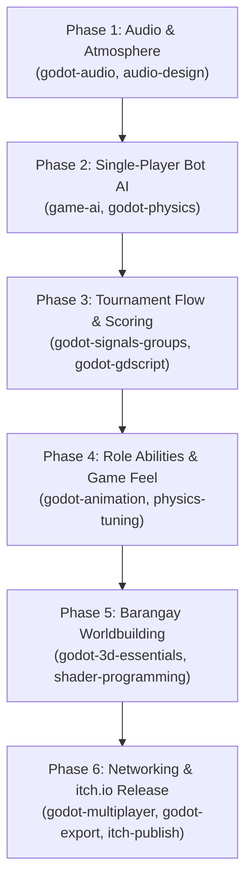

# Patintero 3D: Intricate Development Roadmap

This roadmap organizes the evolution of **Patintero 3D** from a working prototype into a feature-complete, culturally authentic, and engaging multiplayer game on **itch.io**. Every phase is mapped to specialized **Godot 4.7** engineering skills.

---

---

## Phase 1: Soundscape & Audio Architecture
**Mapped Skills:** `godot-audio`, `audio-design`

Patintero is driven by street noise, shout calls, and the physical sound of feet scuffing against asphalt. Without audio, first-person tension is halved.

### Deliverables:
1. **Bus Architecture & Routing (`godot-audio`):**
   * Configure `AudioServer` buses: `Master`, `Music`, `SFX`, `Footsteps`, `Ambiance`, and `Voice/Calls`.
   * Apply subtle ducking so sudden referee whistle blasts cut through ambient noise.
2. **Physical First-Person SFX:**
   * **Footsteps & Slipper Slaps (*Tsinelas*):** Distinct audio depending on sprint vs. crouch vs. slide.
   * **Tag Slap (*Taga*):** A punchy, visceral contact sound when a defender successfully tags a runner.
   * **Referee Whistle (*Pito*):** Sharp whistle burst on tag turnovers, fouls, and home runs.
   * **Stamina Panting:** Audio feedback when runner stamina drops below 20%.
3. **Barangay Street Ambiance (`audio-design`):**
   * Distant tricycles humming, neighborhood dogs barking, evening cicadas, and the ambient echo of an outdoor basketball court.

---

## Phase 2: Solo Practice & Bot AI
**Mapped Skills:** `game-ai`, `godot-physics`

A multiplayer game needs a single-player mode so players can practice mechanics, explore roles, and play offline.

### Deliverables:
1. **Runner Bot AI (State Machine):**
   * **States:** `IDLE_OUTSIDE` $\rightarrow$ `PROBE_LINE` $\rightarrow$ `BAIT_GUARD` $\rightarrow$ `SPRINT_GAP` $\rightarrow$ `RETURN_LEG`.
   * Bot scans the assigned line guard’s current X position. If the guard is committed to the left, the bot sprints through the right gap.
2. **Line Guard Bot AI:**
   * Tracks the nearest active runner inside the adjacent box and mirrors their X coordinate along the line.
   * Integrates human reaction delay (0.15s–0.25s) and reach sweeps when a runner attempts to cross.
3. **Patotot Bot AI (Pincer Coordinator):**
   * Switches to the **Center Spine** when runners push into Box 3/4, coordinating with horizontal line guards to corner runners against the boundary.

---

## Phase 3: Match Flow, Inning Rotation & Scoring
**Mapped Skills:** `godot-signals-groups`, `godot-gdscript`

Transitions the prototype from an infinite sandbox into formal matches with rounds, turnovers, and scoring.

### Deliverables:
1. **Official Scoring Rules (Palarong Pambansa Standard):**
   * Advance from Entrance to Line 2: **+1 Point**
   * Advance to Line 3: **+2 Points**
   * Advance to Line 4 (Back line): **+3 Points**
   * Return leg: **+3, +4, +5 Points**
   * Full Round Trip (Home Run / *Puntos*): **Bonus 20 Points**
2. **Turnover & Role Swapping:**
   * **Street Rules Mode:** Single tag triggers instant side swap (*"Taya!"*).
   * **Tournament Mode:** 2-minute timed innings; teams swap offense/defense at halftime.
3. **Scoreboard & Game Over Screen (`godot-ui-control`):**
   * Halftime summary and post-match victory celebration.

---

## Phase 4: Role Abilities & Game Feel
**Mapped Skills:** `godot-animation`, `physics-tuning`, `input-systems`

Gives each role distinct tactile identity while remaining true to the traditional street game.

### Deliverables:
1. **Runner Kit:**
   * **Slide / Duck:** Sprint + Crouch triggers a baseball slide under high tag lunges.
   * **Juke / Feint:** Double-tapping `A` or `D` performs a quick lateral jolt to bait defender swings.
2. **Defender Kit:**
   * **Patotot Spine Dash:** Temporary burst of speed down the vertical line (8s cooldown).
   * **Wide Sweep:** Holding tag charges a wider 2-meter arc with an increased recovery penalty if missed.
3. **Input Customization (`input-systems`):**
   * Full gamepad/controller support with analog deadzones and in-game key rebinding menu.

---

## Phase 5: Barangay Worldbuilding & Visual Polish
**Mapped Skills:** `godot-3d-essentials`, `shader-programming`

Infuses the 3D court with authentic Philippine street culture.

### Deliverables:
1. **Environment Assets:**
   * Sari-sari store with hanging snack bags, soft drink crates, and corrugated tin roofing.
   * Concrete hollow-block walls with election posters and street signs.
   * Parked tricycles or jeepneys on the sidewalk edge.
2. **Shaders & VFX (`shader-programming`):**
   * **Chalk Line Shader:** Realistic dusty, broken chalk edges that fade slightly in high-traffic zones.
   * **Dust Particles:** Small dust puffs when sliding, jumping, or landing.
3. **Character Models:**
   * Stylized low-poly Pinoy street characters (wearing slippers/sandals, jerseys, and t-shirts).

---

## Phase 6: itch.io Packaging & Networking
**Mapped Skills:** `godot-multiplayer`, `godot-export`, `itch-publish`

Prepares the game for public distribution on itch.io.

### Deliverables:
1. **Room Code System (`godot-multiplayer`):**
   * Replace manual IP entry with 4-letter room codes using a lightweight relay or WebRTC signaling.
2. **HTML5 / WebGL Export (`godot-export`):**
   * Optimize assets and shaders so players can play directly in their web browser on itch.io without downloading a `.exe`.
3. **Automated Publishing (`itch-publish`):**
   * Set up Butler CLI scripts (`butler push`) for one-command builds to Windows and Web channels.
